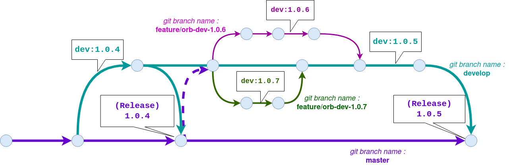

Utiliser ce Token Circle CI pour faire les release d'Orb dans le config.yml :

```bash
$ secrethub tree graviteeio/cicd
cicd/
├── admin/
│   └── circleci/
│       └── nicolas/
│           └── token

```
